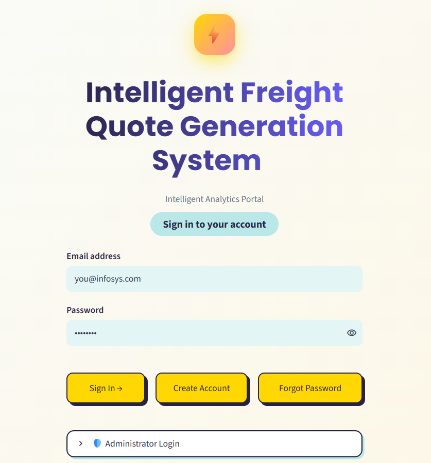
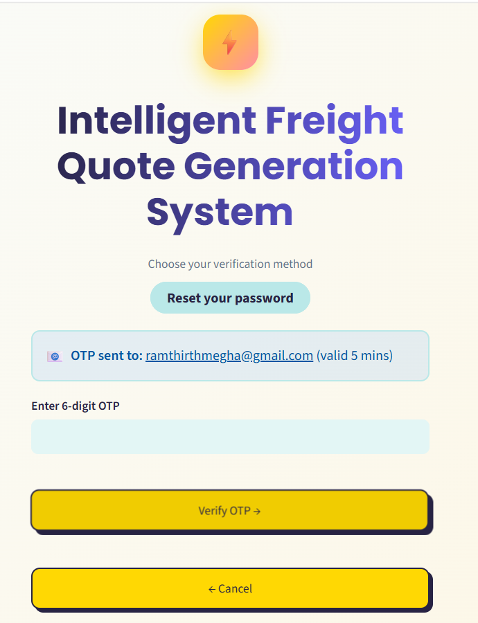

# Milestone 1 — User Authentication Module

**Infosys Springboard Internship 7.0 · Batch 1**

## What This Milestone Is

This milestone implements a complete **Login · Signup · Forgot Password** authentication
system as a single-page Streamlit application, run inside Google Colab and exposed
publicly through an ngrok tunnel. Sessions are managed with JWT, and password recovery
supports both a security-question flow and an email-based OTP flow sent via Gmail SMTP.

## Architecture

The whole app is one Python script (`app.py`), written to disk by a Colab cell and run
as a background Streamlit process, tunnelled to the public internet by ngrok.

```
┌─────────────┐   writes    ┌──────────┐   runs as    ┌────────────┐   public URL   ┌────────┐
│ Colab Cell  │ ──────────▶ │ app.py   │ ───────────▶ │ Streamlit  │ ─────────────▶ │ ngrok  │
│ (%%writefile)│            │ (script) │              │  process   │                │ tunnel │
└─────────────┘             └──────────┘              └────────────┘                └────────┘
                                  │
                    ┌─────────────┼──────────────┐
                    ▼             ▼               ▼
             ┌────────────┐ ┌───────────┐  ┌──────────────┐
             │  SQLite DB │ │  PyJWT     │  │  Gmail SMTP  │
             │ (users     │ │ (session   │  │ (OTP emails) │
             │  table)    │ │  tokens)   │  │              │
             └────────────┘ └───────────┘  └──────────────┘
```

- **Colab Secrets** feed `JWT_SECRET`, `EMAIL_ADDRESS`, `EMAIL_PASSWORD`, `NGROK_AUTHTOKEN`,
  and `ADMIN_USERNAME`/`ADMIN_PASSWORD` into the environment at launch — nothing sensitive
  is hardcoded in `app.py`.
- **SQLite** (`infosys_portal.db`) stores registered users: username, email, a bcrypt
  password hash, a security question, and a bcrypt-hashed security answer.
- **PyJWT** issues a signed, time-limited token on login, stored in Streamlit's session
  state — this token (not a server-side session) is what keeps a user "logged in."
- **Gmail SMTP** sends the one-time password for the Forgot Password → Email OTP route;
  the OTP itself is never stored in the database, only hashed inside a short-lived JWT.
- **Admin access** is a separate, hardcoded credential check — completely independent of
  the `users` table — so the admin is not a signup account.

## Features Built

- **Login** — sign in with either username or email + password. A single generic error
  is shown on failure so it never reveals whether the username or password was wrong.
- **Signup** — username, email, password, confirm password, security question (from a
  fixed list) and security answer. Usernames and emails must be unique.
- **Forgot Password** — two independent recovery routes on the same page:
  - *Security Question* — enter your username, answer your saved question, set a new password.
  - *Email OTP* — enter your registered email, receive a 6‑digit code by email (5‑minute
    expiry), verify it, then set a new password.
- **JWT session handling** — a signed JWT is issued on successful login and stored in
  Streamlit session state; the Dashboard only renders when a valid, unexpired token is present.
- **Field validation**
  - No form submits with an empty required field.
  - Email must match the pattern `ab@cd.ef` (≥2 letters before `@`, ≥2 letters between `@`
    and the final dot, ≥2 letters after the final dot).
  - Password must be ≥8 characters with at least one uppercase letter, one lowercase
    letter, one number and one special symbol; Confirm Password must match exactly.
- **User Dashboard** — welcome message with the logged-in username/email and a Logout action.
- **Admin Dashboard** — separate admin login (credentials defined in code / Colab Secrets,
  not a signup account) that lists every registered user's username and email — passwords
  are never displayed.
- **Secrets management** — `JWT_SECRET`, `NGROK_AUTHTOKEN`, `EMAIL_ADDRESS`, `EMAIL_PASSWORD`
  (and optional `ADMIN_USERNAME` / `ADMIN_PASSWORD`) are all read from Google Colab Secrets —
  nothing sensitive is hard-coded in the notebook.

## Tech Stack

| Layer | Technology |
|---|---|
| UI / Frontend | Streamlit (custom CSS — yellow/teal neo-brutalist style) |
| Auth / Sessions | PyJWT (JSON Web Tokens) |
| Password hashing | bcrypt |
| Database | SQLite (local file, auto-created on first run) |
| OTP delivery | Gmail SMTP (smtplib) |
| Public tunnel | ngrok (pyngrok) |
| Runtime | Google Colab |

## How to Run

1. Open `Login_Page.ipynb` in Google Colab.
2. Click the **key icon** (Secrets) in the left sidebar and add:
   - `JWT_SECRET` — any long random string
   - `NGROK_AUTHTOKEN` — your ngrok Authtoken
   - `EMAIL_ADDRESS` — the Gmail address that will send OTP emails
   - `EMAIL_PASSWORD` — the Gmail **App Password** for that address (not your normal password)
   - *(optional)* `ADMIN_USERNAME` / `ADMIN_PASSWORD` — override the default admin login
3. Toggle **notebook access ON** for each secret.
4. Run the three cells top to bottom (install → write `app.py` → launch).
5. Open the printed ngrok URL in your browser.
6. Sign up as a user, or use the **Admin** tab to sign in as an administrator.

## Setting Up ngrok

1. Create a free account at [ngrok.com](https://ngrok.com).
2. On your ngrok dashboard, copy your personal **Authtoken**.
3. In Colab, click the **key icon 🔑** (Secrets) in the left sidebar.
4. Add a new secret named `NGROK_AUTHTOKEN`, paste the token as its value, and toggle notebook access **ON**.

## Setting Up a Gmail App Password (for sending OTP emails)

1. Open your Google Account settings for the Gmail address you want to send OTPs from.
2. Turn on **2-Step Verification** — an App Password option won't appear until this is enabled.
3. In the Google Account search bar, search for **"App Passwords"** and open it.
4. Create a new app password and label it (e.g. "Infosys Portal").
5. Click **Create** — Google shows a 16-character password once.
6. Copy it immediately (it can't be viewed again after closing).
7. In Colab Secrets, add `EMAIL_ADDRESS` (your Gmail address) and `EMAIL_PASSWORD` (the 16-character App Password, not your normal Gmail password).

## Screenshots

<p align="center">
  <b>Login page</b><br>
  <br><br>
  This is the main entry point of the app, asking for a username or email along with a password. If the credentials don't match, only a single generic error is shown, never revealing whether the username or the password was the wrong part. On success, a signed JWT session token is issued and the user is taken to their Dashboard.
  
  
  <b>Signup page</b><br>
  <br><br>
  New users create an account here by providing an email, a password (validated for strength), and a security question with a saved answer for future recovery. Username is optional — if left blank, it's automatically derived from the email address. The email and password are both validated in real time before the account is created.

  
  <b>Signup Validation Error</b><br>
  <br><br>
  This shows the form actively rejecting bad input — either a malformed email (not matching the ab@cd.ef pattern) or a weak password missing an uppercase letter, number, or special character. It demonstrates that no account can be created until every field meets the required format. This protects the database from incomplete or insecure entries from the very first step.

  
  <b>Forgot password</b><br>
  <br><br>
 This feature lets a user regain access to their account without needing to remember their current password, through two independent recovery paths available on the same page. The first option verifies identity using a security question the user set during signup, while the second sends a time-limited one-time code to their registered email. Both routes ultimately converge on the same step — setting a brand-new password — which is validated for strength and checked to ensure it isn't identical to the user's previous password. This dual-route design gives users a backup recovery method in case they've forgotten their security answer or don't have access to the same device, while keeping every step secured with hashing and short-lived tokens rather than plain-text comparisons.

  
  <b>Forgot Password — Security Question route</b><br>
  <br><br>
  This route lets a user recover their account by answering the same security question they set during signup. The system checks the answer against a securely hashed version stored in the database, never comparing it in plain text. Once verified, the user is allowed to set a brand-new password, with checks in place to stop them from reusing their old one.

  
  <b>Forgot Password — Email OTP route</b><br>
  <br><br>
  This is the second recovery path: instead of a security question, a 6-digit one-time code is emailed to the user's registered address. The code expires after 5 minutes and is never stored directly in the database — only a hashed version is embedded inside a short-lived token. Once the code is verified, the user can proceed to set a new password.

  
  <b>Actual OTP</b><br>
  <br><br>
  This is the actual email delivered to the user's Gmail inbox, sent through Gmail's SMTP server using an App Password rather than the account's real password. It clearly displays the 6-digit verification code, states its expiry time, and includes a disclaimer in case the user didn't request it. This confirms the email delivery pipeline is fully functional end-to-end.

  
  <b>User Dashboard</b><br>
  <br><br>
  Once logged in, a regular user lands here and sees a personalized welcome message along with their session details. This page is only rendered if a valid, unexpired JWT token is present — proving the session-based access control is working correctly. A Logout option is available to immediately clear the session and return to the Login page.

  
  <b>Administrator Login</b><br>
  <br><br>
  This is a separate login panel, completely independent of the regular signup/login system — the admin's credentials are defined in code or Colab Secrets, not stored as a database record. This satisfies the requirement that admin access must not be tied to a signup account. Entering the wrong admin credentials here shows an error without affecting the regular user login flow at all.

  
  <b>Admin Dashboard</b><br>
  
  After logging in as an administrator, this page displays a table of every registered user's username and email address. Passwords are intentionally excluded from this view entirely, even in hashed form, to keep the admin's visibility limited to non-sensitive account data. This gives the administrator basic oversight of all registered accounts without compromising user security.
</p>
