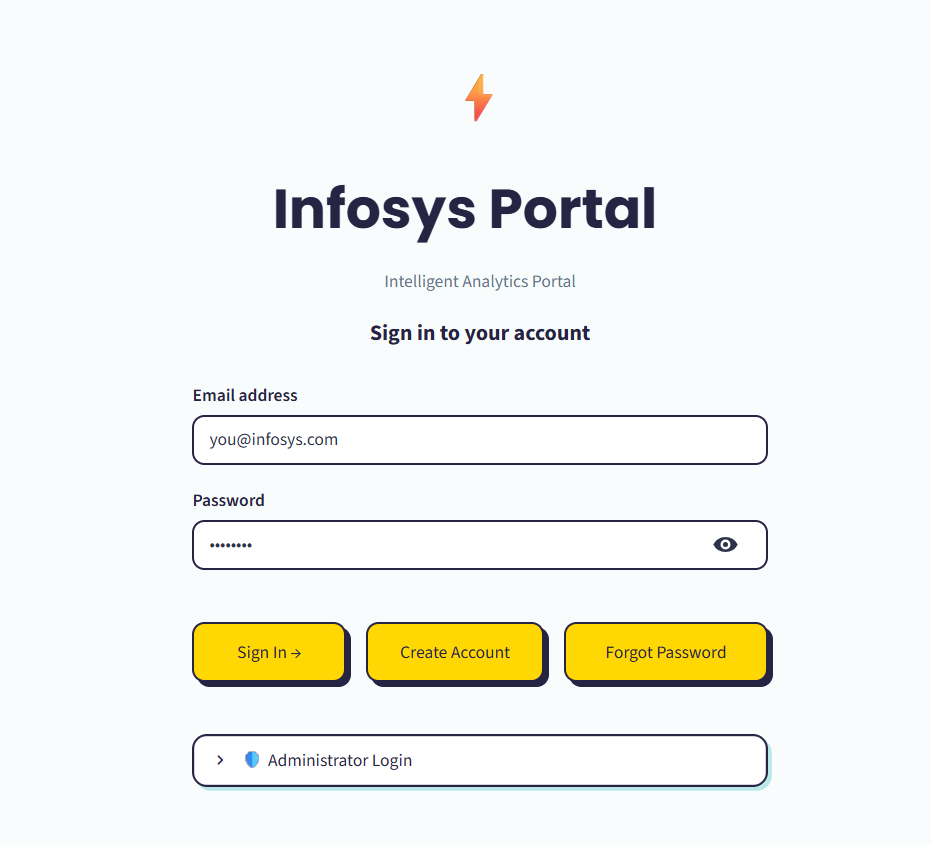
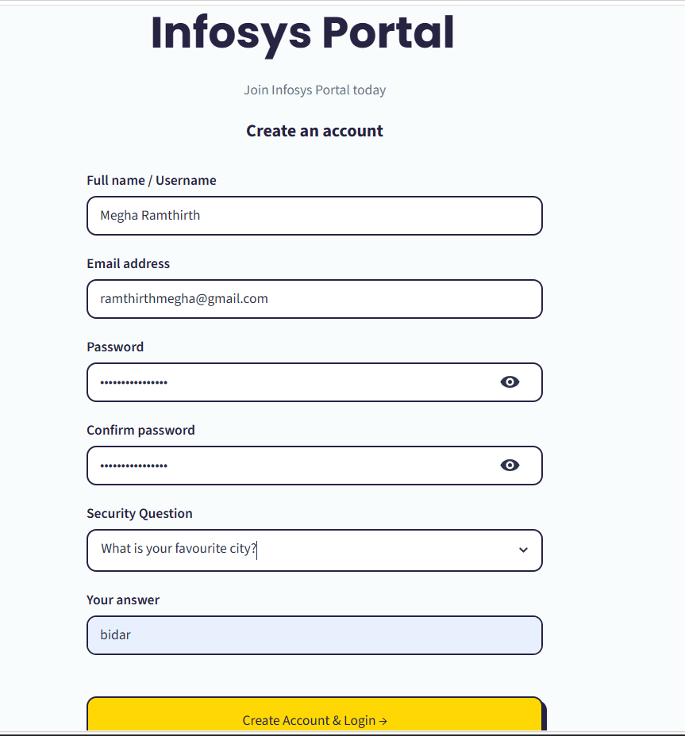
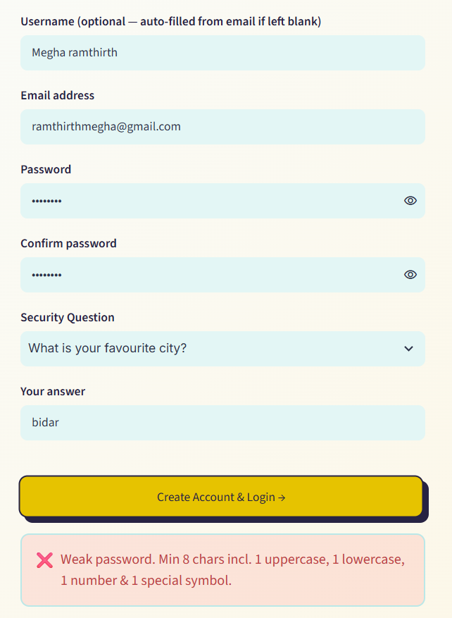
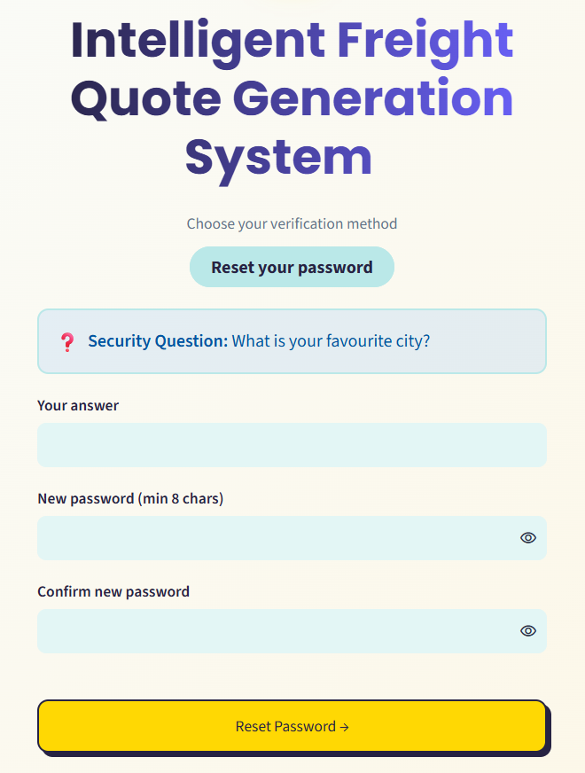
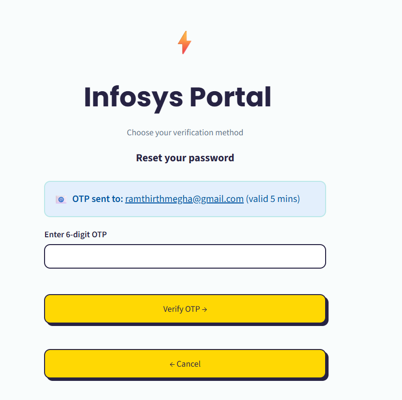
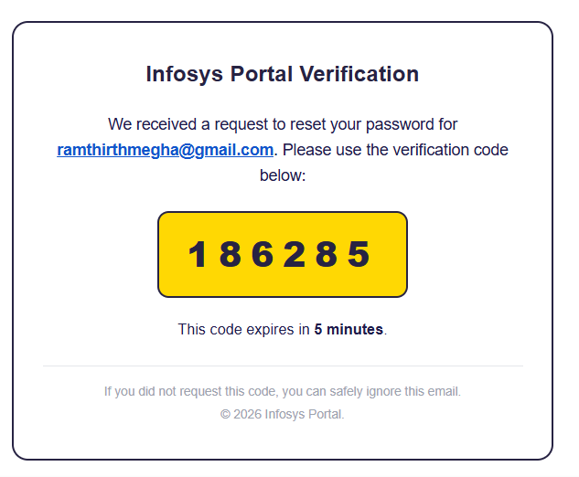
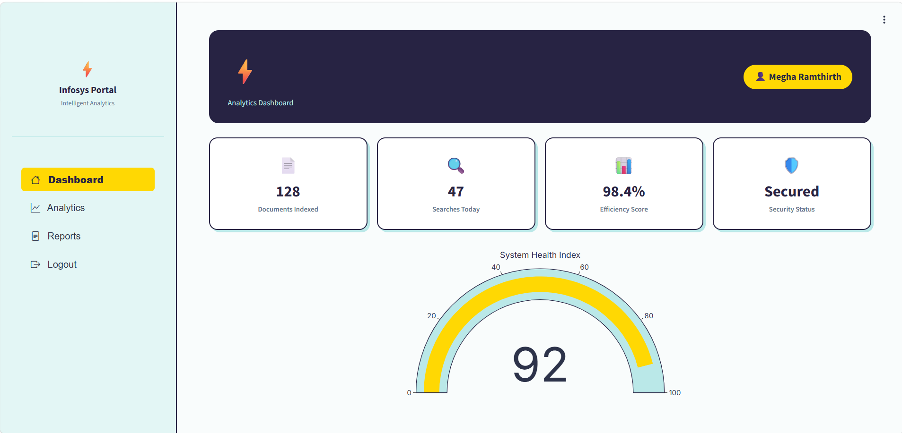
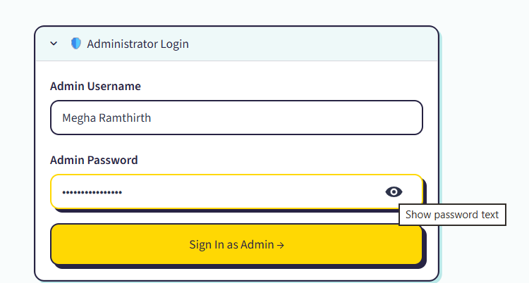
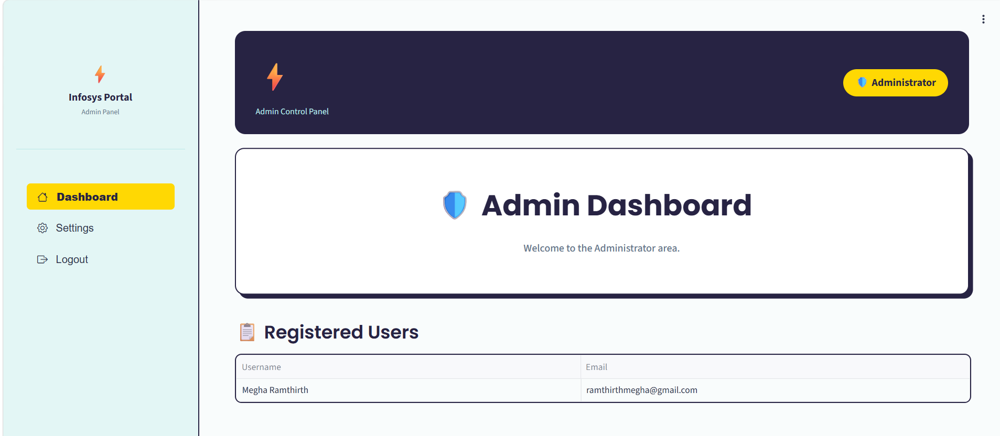

# Milestone 1 — User Authentication Module

**Infosys Springboard Internship 7.0 · Batch 1**

## What This Milestone Is

This milestone implements a complete **Login · Signup · Forgot Password** authentication
system as a single-page Streamlit application, run inside Google Colab and exposed
publicly through an ngrok tunnel. Sessions are managed with JWT, and password recovery
supports both a security-question flow and an email-based OTP flow sent via Gmail SMTP.

## Architecture

The whole app is one Python script (`app.py`), written to disk by a Colab cell and run
as a background Streamlit process, tunnelled to the public internet by ngrok.

```
┌─────────────┐   writes    ┌──────────┐   runs as    ┌────────────┐   public URL   ┌────────┐
│ Colab Cell  │ ──────────▶ │ app.py   │ ───────────▶ │ Streamlit  │ ─────────────▶ │ ngrok  │
│ (%%writefile)│            │ (script) │              │  process   │                │ tunnel │
└─────────────┘             └──────────┘              └────────────┘                └────────┘
                                  │
                    ┌─────────────┼──────────────┐
                    ▼             ▼               ▼
             ┌────────────┐ ┌───────────┐  ┌──────────────┐
             │  SQLite DB │ │  PyJWT     │  │  Gmail SMTP  │
             │ (users     │ │ (session   │  │ (OTP emails) │
             │  table)    │ │  tokens)   │  │              │
             └────────────┘ └───────────┘  └──────────────┘
```

- **Colab Secrets** feed `JWT_SECRET`, `EMAIL_ADDRESS`, `EMAIL_PASSWORD`, `NGROK_AUTHTOKEN`,
  and `ADMIN_USERNAME`/`ADMIN_PASSWORD` into the environment at launch — nothing sensitive
  is hardcoded in `app.py`.
- **SQLite** (`infosys_portal.db`) stores registered users: username, email, a bcrypt
  password hash, a security question, and a bcrypt-hashed security answer.
- **PyJWT** issues a signed, time-limited token on login, stored in Streamlit's session
  state — this token (not a server-side session) is what keeps a user "logged in."
- **Gmail SMTP** sends the one-time password for the Forgot Password → Email OTP route;
  the OTP itself is never stored in the database, only hashed inside a short-lived JWT.
- **Admin access** is a separate, hardcoded credential check — completely independent of
  the `users` table — so the admin is not a signup account.

## Features Built

- **Login** — sign in with either username or email + password. A single generic error
  is shown on failure so it never reveals whether the username or password was wrong.
- **Signup** — username, email, password, confirm password, security question (from a
  fixed list) and security answer. Usernames and emails must be unique.
- **Forgot Password** — two independent recovery routes on the same page:
  - *Security Question* — enter your username, answer your saved question, set a new password.
  - *Email OTP* — enter your registered email, receive a 6‑digit code by email (5‑minute
    expiry), verify it, then set a new password.
- **JWT session handling** — a signed JWT is issued on successful login and stored in
  Streamlit session state; the Dashboard only renders when a valid, unexpired token is present.
- **Field validation**
  - No form submits with an empty required field.
  - Email must match the pattern `ab@cd.ef` (≥2 letters before `@`, ≥2 letters between `@`
    and the final dot, ≥2 letters after the final dot).
  - Password must be ≥8 characters with at least one uppercase letter, one lowercase
    letter, one number and one special symbol; Confirm Password must match exactly.
- **User Dashboard** — welcome message with the logged-in username/email and a Logout action.
- **Admin Dashboard** — separate admin login (credentials defined in code / Colab Secrets,
  not a signup account) that lists every registered user's username and email — passwords
  are never displayed.
- **Secrets management** — `JWT_SECRET`, `NGROK_AUTHTOKEN`, `EMAIL_ADDRESS`, `EMAIL_PASSWORD`
  (and optional `ADMIN_USERNAME` / `ADMIN_PASSWORD`) are all read from Google Colab Secrets —
  nothing sensitive is hard-coded in the notebook.

## Tech Stack

| Layer | Technology |
|---|---|
| UI / Frontend | Streamlit (custom CSS — yellow/teal neo-brutalist style) |
| Auth / Sessions | PyJWT (JSON Web Tokens) |
| Password hashing | bcrypt |
| Database | SQLite (local file, auto-created on first run) |
| OTP delivery | Gmail SMTP (smtplib) |
| Public tunnel | ngrok (pyngrok) |
| Runtime | Google Colab |

## How to Run

1. Open `Login_Page.ipynb` in Google Colab.
2. Click the **key icon** (Secrets) in the left sidebar and add:
   - `JWT_SECRET` — any long random string
   - `NGROK_AUTHTOKEN` — your ngrok Authtoken
   - `EMAIL_ADDRESS` — the Gmail address that will send OTP emails
   - `EMAIL_PASSWORD` — the Gmail **App Password** for that address (not your normal password)
   - *(optional)* `ADMIN_USERNAME` / `ADMIN_PASSWORD` — override the default admin login
3. Toggle **notebook access ON** for each secret.
4. Run the three cells top to bottom (install → write `app.py` → launch).
5. Open the printed ngrok URL in your browser.
6. Sign up as a user, or use the **Admin** tab to sign in as an administrator.

## Screenshots

### Login Page


the sign-in form with username/email and password fields.


### Signup Page


account creation with username, email, password, security question and answer.


### Signup Validation Error


shows the email/password format error being caught in real time.


### Forgot Password


lets a user regain access to their account without knowing their current password, by verifying their identity through either a saved security question or a one-time code emailed to their registered address, before letting them set a new password.


### Forgot Password - Security Question route


recovering access by answering the saved security question.


### Forgot Password - Email OTP route


recovering access by requesting a 6-digit code via email.


### OTP Email


the verification email received in Gmail, containing the time-limited code.


### User Dashboard


the logged-in member view with a welcome message and logout option.


### Administrator Login


the separate admin sign-in panel on the Login page.


### Admin Dashboard


the admin view listing every registered user's username and email.


